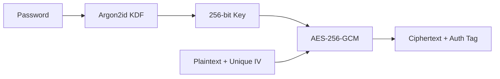

# Encryption Architecture

JustSyncIt implements AES-256-GCM authenticated encryption for data protection with Argon2id key derivation.

## Overview



## Components

### Encryption (AES-256-GCM)
- **Key Size**: 256 bits
- **IV Size**: 96 bits (unique per chunk)
- **Auth Tag**: 128 bits
- **Thread Safety**: ThreadLocal cipher instances

### Key Derivation (Argon2id)
- **Memory**: 512 KB (configurable)
- **Iterations**: 3
- **Salt**: 128 bits (random per key)

### Key Storage (PKCS12)
- Location: `~/.justsyncit/keys/`
- Password-protected keystore
- Atomic writes for crash safety
- Versioned keys for rotation

## Pipeline Integration

```
Read → Hash → Compress → Encrypt → Send
```

The `EncryptStage`:
1. Uses processed data (post-compression)
2. Generates unique 96-bit IV per chunk
3. Binds transfer ID as associated data (AEAD)
4. Prepends IV to ciphertext

## Key Rotation

Rotation triggers (configurable):
- **Age**: 90 days default
- **Volume**: 1 TB encrypted data
- **Operations**: 1 billion encryptions

Old keys preserved for decrypting existing backups.

## Security Properties

| Property | Implementation |
|----------|----------------|
| Confidentiality | AES-256-GCM encryption |
| Integrity | GCM authentication tag |
| Authenticity | AEAD with transfer ID binding |
| Key Protection | PKCS12 keystore + Argon2id |
| IV Uniqueness | SecureRandom per chunk |
